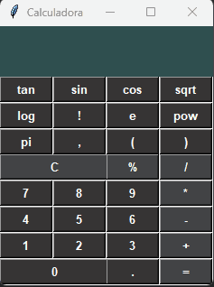

# Calculadora

 *Calculadora Científica*
 
***

 

***
## Agradecimentos :clap:

* Primeiramente a Deus. 
* Meus sinceros agradecimentos a todos que visitam o projeto e deixa uma estrela como reconhecimento.
* Foi muito gratificante ir acompanhando o video e a explicação para fazer a calculadora do zero. 
* Agradeço muito ao Rapaz por passar o seu conhecimento e explicar muito bem.
* Gostaria de saber como faz o Log10(10) funcionar, caso alguém saiba, por favor entre em contato e acrescente esse codigo.
* Ao canal do [Usando Pythond](https://www.youtube.com/watch?v=XjInd_6Og0I)  de onde tirei toda a inspiração para dar esse passo inicial nesse projeto.

***
